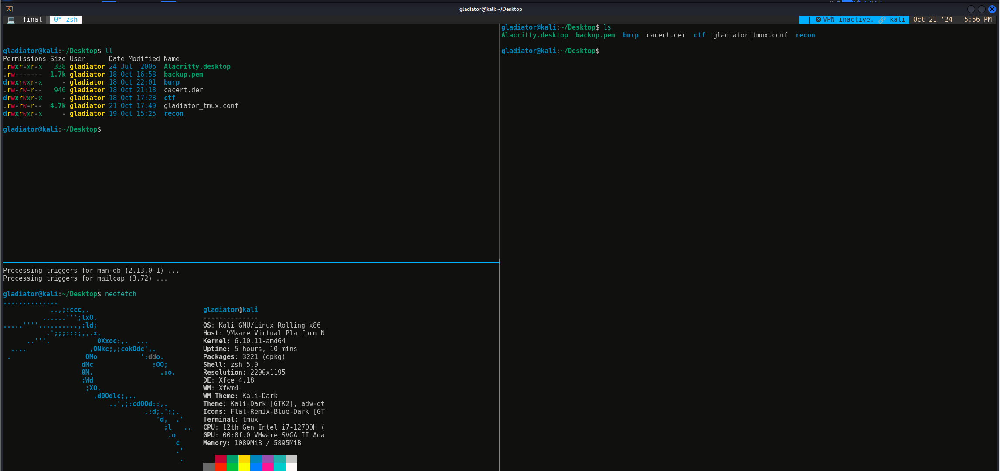

# My Tmux Configuration

### Features:
1. Show VPN IP address in the status bar when connected to VPN.
2. Supports mouse functions. Mouse clicks can be used to switch splits, windows, sessions, etc. Scrolling with the mouse wheel activates copy mode, allowing selection with the mouse cursor.

### Update (21/10/2024):
- Configuration Overhaul: Simplified the setup for improved readability and functionality. Think of it as 
  upgrading from instant ramen to gourmet noodles!
- Color Palette Refresh: Revamped the color scheme for a more vibrant terminal experience.
- Plugin Enhancements: Integrated tmux plugins to boost productivity.
- Bashrc Clean-up: Removed conflicting bashrc settings to streamline your shell environment.

### Future Enhancements:
- Color Customization: I'm on the lookout for more exciting color options. If you have suggestions, feel 
  free to contribute!

### Screenshots:
Default look with Tunnel and SSH scripts. Remove those if you think it's too messy.



### Installation:
1. **clone the repository **
```bash
git clonehttps://github.com/aryan-mrrobot/tmux_config.git

cd tmux_config
```
2. **Run the Installation Script:**
```bash
chmod +x install.sh
./install.sh
```
3.**Install Required Plugins**
```bash
git clone https://github.com/tmux-plugins/tpm ~/.tmux/plugins/tpm
```
Then, launch tmux and press `prefix + I` to install the plugins.

# Additional Tips:
Clipboard Functionality: Ensure you have xclip installed for clipboard operations:
```bash
sudo apt install xclip
```
Icon Support: For enhanced icon display, add the following alias to your shell configuration file:
```bash
alias tmux='tmux -u'
```
Feel free to adjust any sections to better match your style or add any other information you think is relevant!
